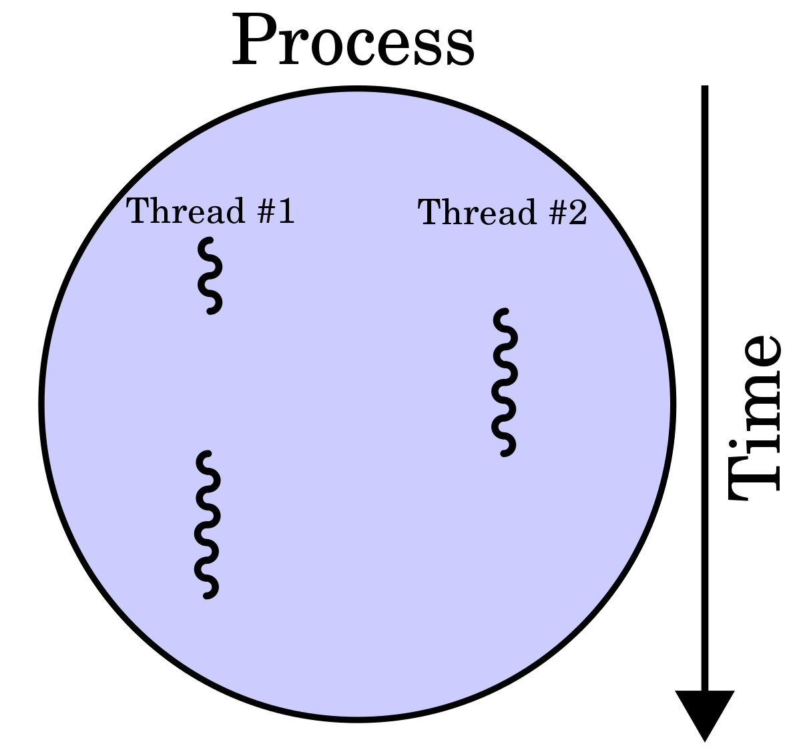

# Simple App Doesn't Always Mean Simple Engineering: A Journey in Building Sentiport

So one of the latest projects we had in Supertype was Sentiport. It's really the short of "Sentiment Reporting". As its name, it's designed as a super-minimalistic app for sentiment analysis automated reporting. This web app scrapes data from google play store and then send you the analysis as a pdf file to your email. To give you an idea of how simple it is, here's a peek:

*The user-facing form*

In this article, I'll share a not-so-technical story about the engineering cases that we went through, and how we solved each. Not as an absolute right answer, but as an insight that can be criticized

# Problems
## 1. Concurrency and Request Time Limit on Deployment
Before diving into the problem, I'd like to explain a bit about the context:

### Concurrency
Basically, it relates to how several programs can run simultaneously. In our case, the program is the pipeline needed to generate and send the report. With concurrency, we can do things faster

### Request Time Limit
"Request" here could be imagined as the webapp calling the server to generate and send the report. There's a time limit that needs to be fulfilled for this "request"

### Deployment
Deployment could be said as giving our app a place to live. Here, we use a service called [Heroku](heroku.com) to get it done. 

So heroku had a lot of constraints. one of it was request time limit. If we make a request to our website, it should return a response in <= 30 seconds. Of course, this is a problem using our good-ol' brute force method, which takes a whole pipeline running before the request returning something. So we needed a solution which allows:
1. The request to come, and then we directly give a response, notifying that "the request is being processed somewhere". So, here we trick the app a little bit. Instead of processing the report upon request, the server returns an "i owe you note" upon request, notifying that the request will be done in a few minutes.
2. The server which processes the request outside of the app. 
 
## How We Solved it
**Multithreading**

Here goes threading. So we have another thread. You can call this another world within the app which is strictly reserved for running the pipeline: scraping, creating pdf, and sending email. The other world is the webapp that's reserved for accepting request. 

>We managed to do this using Python's built-in Threading library

Though, that isn't all the problem. Because we're using template images to create the pdf, we need access to the images and we also need to store temporary images. We use matplotlib for this, but unfortunately, matplotlib isn't so friendly with multithreading environment, so we needed another technique.  

Here comes locking. Locking is a method where a "resource" can only be accessed with one thread at a time. Here, we can say that our "resource" is the utilities to produce the images. So, with locking, we have a restriction that the image can be accessed by strictly one thread at a time. Only after the thread has finished using the "resource", another thread can use it. And the cycle goes on..

## 2. Tracking app status
After a request has been made, it goes on to a different thread to be processed. As we've mentioned before, the thread is running on a different "world" than the webapp (the one that a user sees). This means that, when the thread runs, the webapp can't access the current status of the pipeline and the thread can't access the webapp to tell how much progress has been done. Here's an example of the statuses that is shown:

 \
*Working Status*

 \
*Error Status*

So, we needed a way to let these two worlds communicate together. 

## How We Solved it
1. JS script

    So the first component that we made was a JS script. It's a functionality the webapp has which pings regularly to the server to check the status of the pipeline. The way it works is that after every request submission, the JS script runs to ping regularly on a certain time interval (we use 10 seconds). After the ping has been responded, we change the webapp page accordingly to show the current status of the pipeline

2. Status Storage

    The next thing we needed was a way to store the progress that can be accessed by the two "worlds" (the webapp and the thread world). We went to several iterations to do this:

    - v1. A global variable
    
        The first try we did was to make a "global variable" that can be accessed by the two worlds. We place this variable inside the "global universe", which is called "the runtime", that both "worlds" can access. This variable is a regular python dictionary. So we have key-value pairs. The key is the unique identifier for a certain thread, and the value is a string containing a description of the phase the pipeline is currently at. The description for a certain thread will be updated periodically as the pipeline runs.

        But this has a problem upon deployment. We found on stack overflow that Heroku often restarts the runtime, which in turn destroys the information contained within the global variable we've made. So, if we store an information for a certain thread, it will soon disappear as the runtime is restarted. So we really needed to solve this problem.

    - v2. Redis
        
        

        Enter redis. It is (with simplification) a key-value store. So you can just imagine a database based on key-values. The difference with global variable is that this is persistent. It is not affected by runtime and can be accessed easily by both "worlds". As it has key-value, the use case is pretty much the same as the global variable: We have unique identifier for every thread as a key, and a value containing status information of that thread

# Conclusion

We need to admit, the app's process is very simple: get a keyword, scrape data, do some plotting, and send it as an emailed pdf. But when we try to make it a usable system, problems start arising as we need to put it in a deployment ecosystem, and make it more user-friendly. It's a hassle, but it's where the lesson lies.

Thank you very much for:
Mentors: Adam and Samuel
Teammate: Nadi

